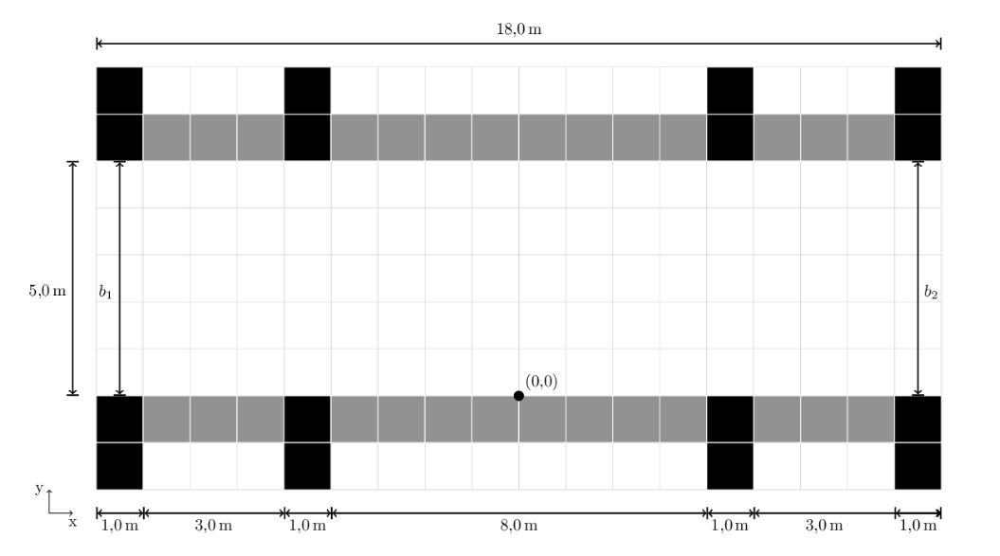

# Laboratorio 01: Cálculo de frecuencia peatonal 
## 1. Introducción 

El problema se enmarca en un interesante experimento que busca analizar cómo la densidad de personas y el ancho de las puertas afectan el tiempo de evacuación en un corredor con dos accesos, correspondientes a puerta 1 y puerta 2, donde además se presenta una simetría entre los lados de salida y entrada realizando una gran cantidad de carreras.
Para el análisis se tendrán en cuenta 2 carreras, las cuales tendrán una dirección de derecha a izquierda con medidas de entrada y salida de 1 y 5 metros para la primera carrera y 5 y 4 metros para la segunda.

### 1.1 Justificación 
La programación científica es esencial para calcular la frecuencia peatonal urbana, procesar datos, modelar cambios y orientar decisiones basadas en evidencia para mejorar la movilidad y calidad de vida. Mediante el análisis de patrones, modelos predictivos y optimización de infraestructuras, se optimiza la accesibilidad peatonal. En síntesis, la programación científica impulsa entornos urbanos amigables y eficientes para peatones.

### 1.3 Objetivos 

**Objetivo General**:
Realizar un análisis de patrones de concentración de personas en un entorno monitoreado a través del procesamiento y análisis de datos de coordenadas capturados por una cámara, utilizando programación científica en Python.

**Objetivos específicos**

1. **Importar y Utilizar Pandas en el Código:** Incorporar la librería Pandas en el entorno de programación y aplicarla con el fin de manejar datos. Esto implicará cargar y procesar información desde un archivo .txt utilizando las funciones proporcionadas por Pandas.

2. **Trabajar con dos Archivos .txt:** Adaptar el código existente resultante del laboratorio anterior con el fin de manejar dos archivos .txt en lugar de solo uno.

3. **Comparar Memoria y Tiempo de Ejecución:** Evaluar el rendimiento del código del primer laboratorio con el código del segundo laboratorio en términos de memoria y tiempo de ejecución.

Estos objetivos permitirán llevar a cabo un análisis detallado de la frecuencia de aparición de coordenadas y la identificación de patrones de concentración de personas, contribuyendo así a una mejor comprensión de la distribución espacial de las personas en el área monitoreada.
## 2. Marco teórico (800 caracteres)

**Librearia** 

**Matplotlib**: Librería para gráficos y visualización de datos.

**Time**: Medición de tiempo en ejecución.

**Pandas**: Análisis y manipulación de datos con DataFrames y Series.

**Estructuras**

**Listas**: Colecciones ordenadas y mutables.

**Cadenas de Texto**: Secuencias de caracteres.

**Herramientas**

**Anaconda**: Plataforma con librerías y ambientes separados.

**Visual Studio**: IDE completo para desarrollo de software.

**GitHub**: Plataforma de alojamiento y colaboración para desarrollo de código.

## 3. Materiales y métodos

En este laboratorio se utilizarán diversos elementos para llevar a cabo el análisis de patrones de concentración de personas a partir de un conjunto de datos capturados por una cámara. A continuación, se detallará cada elemento y la metodología a seguir.
En el desarrollo de este laboratorio, se hará uso de diversos elementos esenciales para llevar a cabo un análisis detallado de patrones de concentración de personas. En primera instancia, se utilizarán dos archivos de texto denominados "UNI_CORR_500_01.txt" y "UNI_CORR_500_06.txt", los cuales contienen una colección de 25.535 y 417.956 muestras de coordenadas respectivamente. Estas coordenadas han sido capturadas mediante una cámara en un entorno específico con la diferenciación de  dimensiones de las entradas y salidas, permitiendo obtener información detallada sobre la ubicación de las personas en dicho espacio, la representacion grafica de el espacio existente para el paso peatonal se evidencian en la siguiente ilustraciones, la cual presenta un largo de 18 metros, siendo el medio el punto (0,0).

*Ilustracion 1: Dimensiones paso peatonal*

 
Es importante resaltar que cada observación contenida en el dataset abarca no solo las coordenadas en los ejes X, Y y Z, sino que también incorpora datos fundamentales como el ID de la persona enfocada y el número de Frame de la cámara correspondiente. Esta combinación de información brinda una visión completa de las posiciones de las personas en relación con su identificación y el momento de captura. 
Para el procedimiento de este laboratorio se realizarán varias etapas cruciales. En primer lugar, emplearemos la plataforma Visual Studio Code junto con el lenguaje de programación Python seguido de la libreria Pandas para cargar los archivos. Una vez completado el proceso de carga extraeremos las coordenadas X e Y del conjunto de datos. A continuación, se realizará la conversión de las coordenadas de metros a pixeles, lo cual nos brindará una representación más precisa de la distribución espacial. Posteriormente, generaremos dos mapas de calor, visualizando claramente las zonas de mayor afluencia de personas en cada caso. Estos mapas de calor serán una herramienta valiosa para comprender de manera intuitiva los patrones de movimiento y concentración en el entorno monitoreado, lo que proporcionará información clave para la toma de decisiones en la planificación urbana y la optimización de la movilidad peatonal. En resumen, este laboratorio fusiona el poder de la programación científica con la visualización de datos para obtener conocimientos profundos sobre la frecuencia peatonal y su distribución en un entorno específico.

En resumen, la secuencia de pasos sería la siguiente:
1. Cargar los archivos "UNI_CORR_500_01.txt" y "UNI_CORR_500_06.txt" utilizando la libreria Pandas en el entorno de Visual Studio Code para su acceso y manipulación.
2. Extraer las coordenadas X e Y de cada observación registrada en el conjunto de datos y transformalas a píxeles.
5. Generar visualizaciones gráficas como mapas de calor en función de las columnas almacenadas para ilustrar de manera efectiva los patrones de concentración peatonal en el entorno. Estas representaciones visuales facilitarán la interpretación y comprensión intuitiva de los resultados obtenidos.

Al llevar a cabo esta secuencia de pasos, lograremos analizar y visualizar de manera precisa la frecuencia peatonal en el entorno estudiado, proporcionando valiosa información para la toma de decisiones en la planificación urbana y la mejora de la movilidad peatonal.
Descripción del Experimento:
El experimento consiste en analizar las coordenadas capturadas por una cámara en un entorno específico con pequeñas variaciones para identificar patrones de concentración de personas. A través del uso de programación científica en Python y herramientas de análisis de datos, se pretende determinar las áreas en las que las personas se agrupan con mayor frecuencia. Este análisis proporcionará información valiosa para la toma de decisiones en la planificación urbana y la mejora de la movilidad en áreas de alta concentración peatonal. El experimento busca contribuir a la comprensión de los patrones de comportamiento de las personas en espacios urbanos, lo que puede tener implicaciones significativas en el diseño de infraestructuras y la implementación de medidas de seguridad y accesibilidad.

## 4. Resultados obtenidos

Para obtener una conclusión certera sobre la realización del experimento se realizaron 2 archivos .py donde se utilizaron distintos métodos de obtención y graficado de los datos, en el archivo "Codigo pandas.py", se utilizó la libreria Pandas, para el cargado y visualización de los datos, donde se realizaron filtros correspondientes para las columnas a utilizar (x e y), en el caso del segundo código, se extrajo la información de los datos, y se utilizaron listas y variables, en conjunto con ciclos for para el cargado de la informacion en los gráficos.

En la tabla a continuación se puede observar como el primero archivo "Codigo pandas.py", presenta una mayor eficiencia computacional, evidenciandose que genera un menor tiempo de utilización, en comparación al código que no utiliza la libreria Pandas. Por otro lado, se observa como el uso de la libreria Pandas genera una mayor utilizaciÓn de memoria que el no uso de esta.

| Tipo de Experimento   | Tiempo de ejecucion (mseg) |  Memoria utilizada (MB) |
|-----------------------|----------------------------|-------------------------|
| Programa Normal (Codigo 1.py) |        730.74           |           40.70        |
| Programa Pandas (Codigo 2.py) |        353.42           |           49.34        |

*Tabla 1: Tiempos de ejecucion*

A continuación se puede visualizar esta diferencia de tiempo y memoria entre el método convencional y la libreria Pandas.

*Ilustracion 2: Matriz de frecuencias*

En cuanto a los resultados obtenidos, se puede concluir que se logró obtener los dos mapas de calor los cuales revelarían cómo se distribuyen las frecuencias de tránsito a lo largo de dicho pasillo correspondientes a cada experimentacion realizada, donde para el caso de la carrera número 1 se tiene la primera puerta, con un tamaño de puerta de entrada de 1 metro y de salida de 5 metros, se pudo observar como las personas, al entrar por la derecha, se van separando entre ellas debido a que una persona se encuentra detenida en la mitad del camino y todas la evitan manteniendo asi su espacio personal y a medida que estan se van acercando a la puerta de salida que se encuentra en la izquierda con el tamaño de 5 metros, se nota como las personas mantienen su separacion ademas de una distancia prudente con las paredes a su alrededor, por otro lado tambien se concluye que como la entrada es de un tamaño pequeño, se produce que entre una cantidad de personas que no sea suficiente para el llenado completo del pasillo ademas de que el espacio ocupado por la persona en el centro reduce el área por donde podrian entrar las personas dejando disponible solo los costados. Además, se puede observar cómo los datos se muestrean únicamente hasta ciertas coordenadas en el eje x, lo que indica que la cámara no captura una vista completa del pasillo.

*Ilustracion 3: Mapa de calor carrera 1*

Para los resultados de la segunda carrera, se realiza una variación en el tamaño de las puertas donde la primera presenta un tamaño de 5 metros y la segunda de 4 metros, observandose en el mapa de calor como las personas entran con un mayor flujo y el pasillo se mantiene lleno, estando mucho más cerca una de las otras, debido a que en la ilustración no se evidencian separaciones entre los puntos. En cuanto a la salida, se observa como a medida que se acercan al final las personas se van juntando a causa del menor tamaño de la puerta lo que podria ralentizar el paso de estas, ya que la agrupacion repercutiría a las personas que se encuentras detrás.

A continuación, se pueden visualizar los mapas de calor para cada caso.

*Ilustracion 3: Mapa de calor carrera 2*

## 5. Conclusiones

Con respecto al tiempo y memoria de procesamiento se pudo concluir que el uso de la libreria pandas produce una
menor utilizacion de tiempo para el procesamiento de la impresion y calculo, esto se puede deber a que la accesibilidad a los datos es mucho mas directa, porque de la tabla entregada por pandas se puede obtener todo tipo de informacion sin realizar algun tipo de ciclo o implementar objetos auxiliares, por otro lado en el segundo codigo se deberan utilizar ciclos for para poder alamacenar los datos en las listas respectivas, lo que generaria un mayor tiempo de procesamiento al realizar el recorrido de todas las filas presentes en los dos archivos. En cuanto a la utilizacion de la memoria se logro identificar que el uso de pandas, implica utilizar una mayor cantidad de memoria para almacenar toda la informacion extraida (Tabla completa) por otro lado, en el caos del segundo codigo, solo se almacenan en 2 listas los datos mas releveantes correspondientes al eje x e y sin necesidad de extraer usuarios, frames o algun otro dato sin relevancia, que genere uso de memoria adicional.

Por parte de los gráficos se puede concluir que la carrera 2 es legiblemente superior a la 1 debido al flujo de personas que permita pasar. Esto se puede deber principalmente a la diferencia de tamaños de entrada y que esta no presenta un obstáculo en esta misma como es en la carrera 1.

Finalmente podemos concluir que se lograron tanto los objetivos especificos como el general, debido a que se pudo importar y utilizar la libreria Pandas, logrando leer los archivos .txt, se logró trabajar con dos de estos archivos y se pudo hacer una comparación de memoria y tiempo de ejecución utilizados con respecto al primer y segundo programa. 

## 6. Referencias
OpenAI. (2021). GPT-3.5 [Modelo de lenguaje AI]. Recuperado de https://openai.com/gpt-3.5

