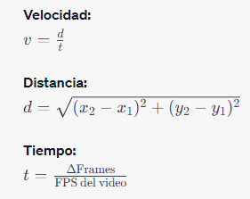
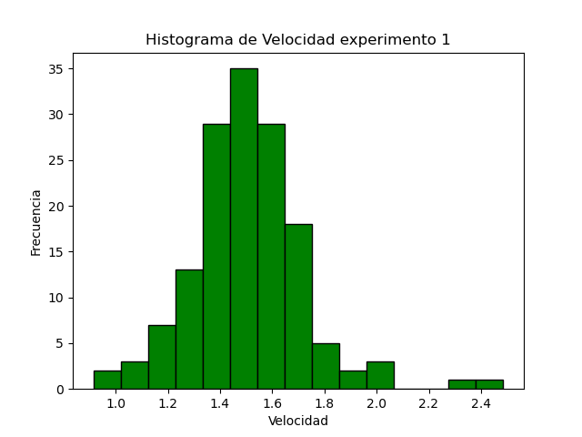
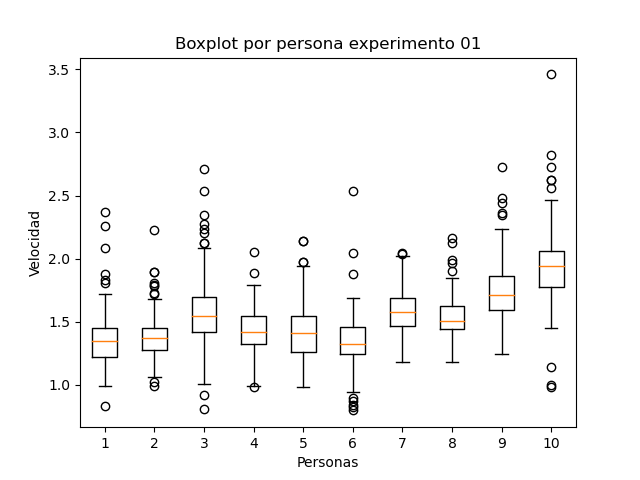
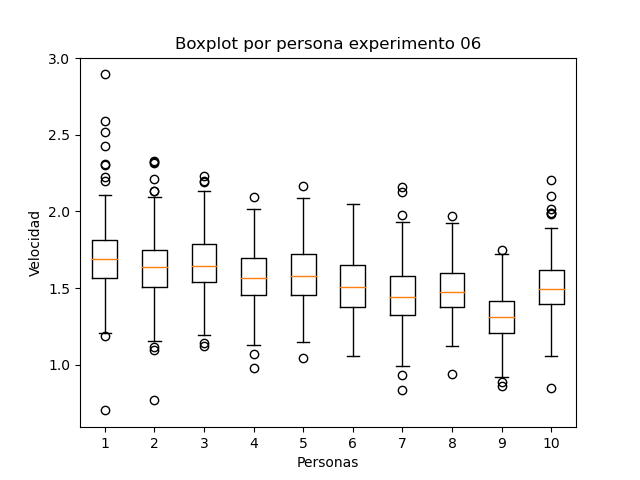
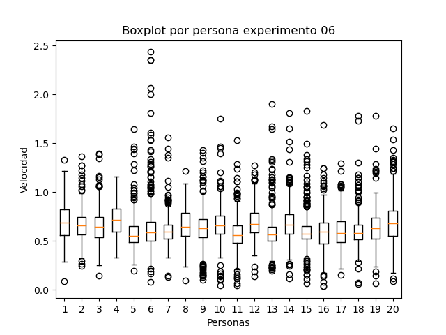

# Laboratorio 01: Cálculo de frecuencia peatonal 
## 1. Introducción 

El presente problema se enmarca en un menester experimento que busca analizar cómo la densidad de las personas y el ancho de las puertas afectan en el tiempo de evacuación en un corredor con dos accesos, correspondientes a puerta uno y puerta dos, en las cuales además se presenta una simetría entre los lados de salida y entrada realizando una gran cantidad de carreras. Ahora bien, el análisis tendrá en cuenta dos carreras, las cuales tendrán una dirección de derecha a izquierda con medidas de entradas y salidas de uno a cinco metros para la primera carrera, mientras que para la segunda de cinco y cuatro metros.

### 1.1 Justificación 
La programación científica es esencial para calcular la frecuencia peatonal urbana, procesar datos, modelar cambios y orientar decisiones basadas en evidencia para mejorar la movilidad y calidad de vida. Mediante el análisis de patrones, modelos predictivos y optimización de infraestructuras, se optimiza la accesibilidad peatonal. En síntesis, la programación científica impulsa entornos urbanos amigables y eficientes para peatones.

### 1.3 Objetivos 

**Objetivo General**:
Realizar un análisis de patrones de concentración de personas en un entorno monitoreado a través del procesamiento y análisis de datos de coordenadas capturados por una cámara, utilizando programación científica en Python.

**Objetivos específicos**

**Calcular Distancias por Frame**: Desarrollar un algoritmo con el propósito de calcular la distancia entre las coordenadas de cada persona en cuadros de tiempo consecutivos.

**Calcular Velocidades de las Personas**: Transformar la distancia recorrida por cada persona en su velocidad individual, dividiendo la distancia recorrida por el intervalo de tiempo correspondiente.

**Analizar Patrones de Velocidad**: Visualizar las velocidades de las personas a través de gráficos con el fin de identificar patrones destacados y variaciones significativas en el comportamiento de movilidad de los participantes.

Estos objetivos permitirán llevar a cabo un análisis detallado de la frecuencia de aparición de coordenadas y la identificación de patrones de concentración y movilidad de las personas, contribuyendo así a una mejor comprensión de la distribución espacial de las personas en el área monitoreada.

## 2. Marco teórico (800 caracteres)

**Librearia** 

**Matplotlib**: Librería para gráficos y visualización de datos.

**Time**: Medición de tiempo en ejecución.

**Pandas**: Análisis y manipulación de datos con DataFrames y Series.

**Estructuras**

**Series**: Secuencia unidimensional de datos.

**Dataframes**: Tabla de datos estructurados.

**Herramientas**

**Anaconda**: Plataforma con librerías y ambientes separados.

**Visual Studio**: IDE completo para desarrollo de software.

**GitHub**: Plataforma de alojamiento y colaboración para desarrollo de código.

## 3. Materiales y métodos

En este laboratorio se utilizarán diversos elementos para llevar a cabo el análisis de patrones de concentración de personas a partir de un conjunto de datos capturados por una cámara. A continuación, se detallará cada elemento y la metodología a seguir.
En el desarrollo de este laboratorio, se hará uso de diversos elementos esenciales para llevar a cabo un análisis detallado de patrones de concentración de personas. En primera instancia, se utilizarán dos archivos de texto denominados "UNI_CORR_500_01.txt" y "UNI_CORR_500_06.txt", los cuales contienen una colección de 25.535 y 417.956 muestras de coordenadas respectivamente, estas son asignadas individualmente a cada persona y se mantienen en el frame en el que aparece dicha persona. Estas coordenadas han sido capturadas mediante una cámara en un entorno específico con la diferenciación de dimensiones de las entradas y salidas, permitiendo obtener información detallada sobre la ubicación de las personas en dicho espacio, la representación gráfica del espacio existente para el paso peatonal se evidencia en la siguiente ilustración, la cual presenta un largo de 18 metros, siendo el medio el punto (0,0).

*Ilustracion 1: Dimensiones paso peatonal*

 

Es importante resaltar que cada observación contenida en el dataset abarca no solo las coordenadas en los ejes X, Y y Z, sino que también incorpora datos fundamentales como el ID de la persona enfocada y el número de Frame de la cámara correspondiente lo cual nos servira para poder obtener el calculo de la velocidad cuando la persona avanza entre los frames. Esta combinación de información brinda una visión completa de las posiciones de las personas en relación con su identificación y el momento de captura. 
Para el procedimiento de este laboratorio se realizarán varias etapas cruciales. En primer lugar, emplearemos la plataforma Visual Studio Code junto con el lenguaje de programación Python seguido de la librería Pandas para cargar los archivos. Una vez completado el proceso de carga extraeremos las coordenadas X e Y acompañadas de el id y frame de la persona, transformando toda esta informacion en un dataframe, para que luego sea agrupado por el id de cada persona y asi proceder a su graficacion.

 A continuación, se desarrollará un algoritmo el cual procese estos datos con el fin calcular la distancia entre las coordenadas en cuadros de tiempo consecutivos. Con esta información, se determinarán las velocidades individuales de las personas medida en metros por segundos lo cual consiste en calcular el desplazamiento del punto x e y a travez de los frames, permitiendo analizar y comparar sus comportamientos de evacuación. La representacion de las formas de calculo se representa a continuacion.

*Ilustracion 1: Ecuaciones*

Para el análisis de estos comportamientos se utilizarán gráficos de histograma y gráficos de cajas y bigotes, lo que proporcionará información clave para la toma de decisiones en la planificación urbana y la optimización de la movilidad peatonal. En resumen, este laboratorio fusiona el poder de la programación científica con la visualización de datos para obtener conocimientos profundos sobre la frecuencia peatonal y su distribución en un entorno específico.

En resumen, la secuencia de pasos sería la siguiente:
1. Cargar los archivos "UNI_CORR_500_01.txt" y "UNI_CORR_500_06.txt" utilizando la librería Pandas en el entorno de Visual Studio Code para su acceso y manipulación traspasando la informacion a un elemento dataframe.
2. Extraer las coordenadas X e Y de cada observación registrada en el conjunto de datos y calcular la distancia entre las coordenadas de cada persona en cuadros de tiempo consecutivos.
3. Calcular la velocidad individual de cada persona dividiendo la distancia recorrida entre coordenadas por el tiempo transcurrido en ese intervalo, siendo agrupado y almacenado en una serie de datos.
4. Generar visualizaciones gráficas como gráficos de histograma y gráficos de cajas y bigotes. Estas representaciones visuales facilitarán la interpretación y comprensión intuitiva de los resultados obtenidos.

Al llevar a cabo esta secuencia de pasos, lograremos analizar y visualizar de manera precisa la frecuencia peatonal en el entorno estudiado, proporcionando valiosa información para la toma de decisiones en la planificación urbana y la mejora de la movilidad peatonal.

Descripción del Experimento:
El experimento tiene como objetivo analizar las coordenadas capturadas por una cámara en un entorno específico, con ligeras variaciones, para identificar patrones en las velocidades de las personas. A través de la aplicación de programación científica en Python y herramientas de análisis de datos, se busca determinar las zonas donde las personas tienden a alcanzar velocidades más altas o bajas. Este análisis de patrones de velocidad proporcionará información valiosa para la toma de decisiones en la planificación urbana y para mejorar la movilidad en áreas de alta concentración peatonal. El objetivo del experimento es contribuir a la comprensión de cómo las personas se desplazan en espacios urbanos, lo que puede influir significativamente en la planificación de infraestructuras y en la implementación de medidas de seguridad y accesibilidad.

## 4. Resultados obtenidos

Para el análisis de resultados obtenidos se creó el archivo "Código pandas.py" el cual nos entrega la información respectiva a las velocidades correspondientes para cada experimento a analizar, dándonos como resultado un tiempo y memoria total utilizada para la ejecución presentados en la siguiente tabla.

| Tipo de Experimento   | Tiempo de ejecucion (mseg) |  Memoria utilizada (MB) |
|-----------------------|----------------------------|-------------------------|
| Programa Normal (Codigo pandas.py) |      1852.044      |          170.85         |

*Tabla 1: Tiempos de ejecucion*

A continuación, se mostrarán los gráficos correspondientes a un histograma y boxplot, para el análisis en cada una de las experimentaciones.

En la experimentación 1, se tiene la primera puerta, con un tamaño de puerta de entrada de 1 metro y de salida de 5 metros, donde las personas entran de derecha a izquierda y se van separando entre ellas debido a que una persona se encuentra detenida en la mitad del camino, con un tamaño de población de 148 personas.

En cuando al histograma, el cual presenta en el eje x las velocidades y en el eje y las frecuencias de estas. En cuando a las velocidades se puede observar que varían desde 1 metros por segundo hasta 2,4 metros por segundo aproximadamente, existiendo algunos valores atípicos cercanos al 2.4 como se observa en el gráfico. En cuanto a la distribución de los resultados, se puede observar que estos siguen aproximadamente, de forma visual y eliminando estos valores atípicos, una distribución normal, ya que se observa que los datos se encuentran sin sesgo alguno entre el rango de 1 y 2 metros por segundo, siendo el valor central 1.5 metros por segundo.

*Grafico 1: Histograma experimento 01*

El primer experimento además presenta un promedio y una varianza de velocidad evidenciados en la tabla siguiente, destacando la baja varianza que se registra, la cual nos indica que se mantiene una velocidad en promedio bastante estable.

|       Promedio     |         Varianza        |
|--------------------|-------------------------|
|        1.505       |          0.0487         |

*Tabla 2: Estadisticas experimento 1*

Por otro lado, también se encuentra un boxplot, el cual grafica las primeras 10 personas, permitiendo analizar el comportamiento individual de estas. En el grafico se logran observan una gran cantidad de valores atípicos en la velocidad de estos, siendo el valor más alto registrado con un total de 3.5 metros por segundo, el cual podría ser despreciable al corresponder a solo un registro, en cuando a las medianas, se puede concluir que en general se encuentra cercana al centro de la caja a excepción de 2 o 3 personas, dando indicios de simetría en los resultados para cada una de ellas.

*Grafico 2: Boxplot experimento 01*

Avanzando con la experimentación 6, se realiza una variación en el tamaño de las puertas donde la primera presenta un tamaño de 5 metros y la segunda de 4 metros, manteniendo el flujo de personas desde el lado derecho al izquierdo. Cabe destacar que la cantidad de personas en esta experimentación corresponde a 913.

A continuación se observa el Histograma correspondiente a la experimentación 6, en este grafico se observa un sesgo hacia la derecha, ya que la mayoría de los datos se encuentran concentrados en el lado izquierdo, disminuyendo hasta un mínimo de aproximado de 0.4 metros por segundos y llegando hasta una velocidad máxima de 1.6 metros por segundos.

*Grafico 3: Histograma experimento 06*

Por otro lado, también se obtuvo las estadísticas correspondientes al promedio y varianza de las velocidades, destacando un promedio de 0.6 metros por segundo, lo cual es mucho menor al promedio registrado en la experimentación anterior.

|       Promedio     |         Varianza        |
|--------------------|-------------------------|
|        0.6512      |          0.0561         |

*Tabla 3: Estadisticas experimento 6*

Continuando con el grafico boxplot, perteneciente a las primeras 10 personas registradas en el experimento, se logra observar cómo los valores promedios que estos nos entregan son mucho mayor al promedio general de la velocidad registrada, lo cual sirve para inferir que inicialmente cuando el pasillo se encuentra vacío, les era más fácil y rápido acceder y pasar a través de él, a diferencia de las personas posteriores.

*Grafico 4: Boxplot experimento 06*

La inferencia planteada anteriormente se ve respaldada, por un segundo grafico boxplot el cual nos entrega información sobre la velocidad de las personas 250 hasta la 269, logrando evidenciarse como los diagramas de caja para cada persona van disminuyendo su valor en el gráfico, ya que las cajas se encuentran ubicadas entre los valores 0.5 y 1 aproximadamente, a diferencia del grafico anterior donde se encontraba posicionada entre el 1 y 2 metro por segundo.

*Grafico 5: Boxplot experimento 06*

## 5. Conclusiones

En conclusión, el análisis exhaustivo de los resultados ha revelado patrones y tendencias significativas en las velocidades observadas en los diferentes experimentos. En el primer escenario, donde la población era moderada, las velocidades presentaban una distribución que se asemeja a una campana de gauss, indicando que la mayoría de las personas se movían a una velocidad constante alrededor de 1.5 metros por segundo. Esto sugiere que, en ese contexto, las personas mantenían una velocidad relativamente estable a pesar de las fluctuaciones.
Sin embargo, en el sexto experimento, con una población más grande y variaciones en el diseño del espacio, las velocidades exhibieron un comportamiento diferente. El histograma mostró una distribución asimétrica hacia la velocidad más baja, lo que podría indicar congestión o alguna influencia externa que limitara la velocidad de desplazamiento. La disminución significativa en el promedio de velocidad corrobora esta observación.
Además, se identificó que las primeras personas tenían velocidades relativamente altas, probablemente debido a la ausencia inicial de obstáculos y a una mayor capacidad para moverse libremente. A medida que más personas ingresaban al pasillo, las velocidades tendían a reducirse, reflejando un efecto de congestión o restricción del espacio.
Estos hallazgos resaltan la importancia de considerar factores como la densidad de personas y el diseño del entorno al analizar las velocidades de desplazamiento. Además, demuestran cómo herramientas visuales como histogramas y boxplots pueden capturar patrones y tendencias que aportan una comprensión más rica y matizada de los resultados. En última instancia, este análisis proporciona información valiosa para la planificación y el diseño de espacios donde el flujo de personas es un factor crítico.

Finalmente podemos concluir que se lograron tanto los objetivos específicos como el general, debido a que se pudo realizar un análisis de patrones de concentración de personas en un entorno monitoreado a través del desarrollo de un algoritmo el cual permitió calcular la distancia entre las coordenadas de cada persona en cuadros de tiempo consecutivos, con ello se logró transformar estas distancias a velocidades y finalizar se pudo realizar un análisis competente mediante la visualización de las velocidades a través de gráficos de histograma y gráficos de cajas y bigotes.

## 6. Referencias
OpenAI. (2021). GPT-3.5 [Modelo de lenguaje AI]. Recuperado de https://openai.com/gpt-3.5

