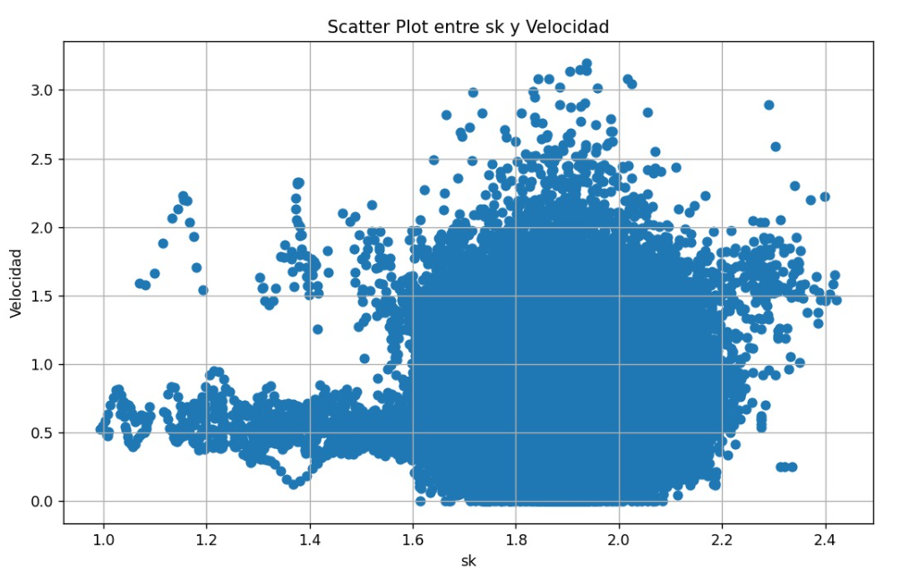

# Laboratorio 01: Cálculo de frecuencia peatonal 
## 1. Introducción 

El presente problema se enmarca en un experimento que busca analizar cómo la densidad de las personas y el ancho de las puertas afectan en el tiempo de evacuación en un corredor con dos accesos, correspondientes a puerta uno y puerta dos, en las cuales además se presenta una simetría entre los lados de salida y entrada realizando una gran cantidad de carreras. Ahora bien, el análisis tendrá en cuenta dos carreras, las cuales tendrán una dirección de derecha a izquierda con medidas de entradas y salidas de uno a cinco metros para la primera carrera, mientras que para la segunda de cinco y cuatro metros.

### 1.1 Justificación 
La programación científica es esencial para calcular la frecuencia peatonal urbana, procesar datos, modelar cambios y orientar decisiones basadas en evidencia para mejorar la movilidad y calidad de vida. Mediante el análisis de patrones, modelos predictivos y optimización de infraestructuras, se optimiza la accesibilidad peatonal. En síntesis, la programación científica impulsa entornos urbanos amigables y eficientes para peatones.

### 1.3 Objetivos 

**Objetivo General**:
Realizar un análisis de patrones de concentración de personas en un entorno monitoreado a través del procesamiento y análisis de datos de coordenadas capturados por una cámara, utilizando programación científica en Python.

**Objetivos específicos**

**Analizar por Cuadros (Frames)**: realizar un análisis en función de cuadros de tiempo. Los datos se filtrarán para cada cuadro y se realizan cálculos y búsquedas de vecinos cercanos específicos para ese cuadro. Esto permitirá comprender cómo varían las relaciones de vecindad y velocidad a lo largo del experimento.

**Identificar Vecinos Cercanos**: identificar y cuantificar los vecinos cercanos de cada peatón en función de las coordenadas espaciales. Se utilizará una estructura de datos KD-Tree para encontrar los peatones cercanos dentro de un radio determinado. La distancia promedio entre el peatón y sus vecinos será calculada y se almacenará en la columna "sk".

**Calcular y Visualizar el Promedio de "sk"**: calcular y visualizar el promedio de la columna "sk" en todo el conjunto de datos. Esto proporcionará una medida general de la interacción entre peatones y su entorno cercano en términos de distancia promedio.

Estos objetivos permitirán llevar a cabo un análisis detallado de la frecuencia de aparición de coordenadas y la identificación de patrones de concentración y movilidad de las personas, contribuyendo así a una mejor comprensión de la distribución espacial de las personas en el área monitoreada.

## 2. Marco teórico (800 caracteres)

**Librearia** 

**Numpy**: Cálculos numéricos eficientes.

**Matplotlib**: Librería para gráficos y visualización de datos.

**Time**: Medición de tiempo en ejecución.

**Pandas**: Análisis y manipulación de datos con DataFrames 
y Series.

**Scipy**: Cálculos científicos.

**Streamlit**: Creación de aplicaciones web.

**Estructuras**

**Series**: Secuencia unidimensional de datos.

**Dataframes**: Tabla de datos estructurados.

**Herramientas**

**Anaconda**: Plataforma con librerías y ambientes separados.

**Visual Studio**: IDE completo para desarrollo de software.

**GitHub**: Plataforma de alojamiento y colaboración para desarrollo de código.

## 3. Materiales y métodos

En este laboratorio se utilizarán diversos elementos para llevar a cabo el análisis de patrones de concentración de personas a partir de un conjunto de datos capturados por una cámara. A continuación, se detallará cada elemento y la metodología a seguir.
En el desarrollo de este laboratorio, se hará uso de diversos elementos esenciales para llevar a cabo un análisis detallado de patrones de concentración de personas. En primera instancia, se utilizarán dos archivos de texto denominados "UNI_CORR_500_01.txt" y "UNI_CORR_500_06.txt", los cuales contienen una colección de 25.535 y 417.956 muestras de coordenadas respectivamente, estas son asignadas individualmente a cada persona y se mantienen en el frame en el que aparece dicha persona. Estas coordenadas han sido capturadas mediante una cámara en un entorno específico con la diferenciación de dimensiones de las entradas y salidas, permitiendo obtener información detallada sobre la ubicación de las personas en dicho espacio, la representación gráfica del espacio existente para el paso peatonal se evidencia en la siguiente ilustración, la cual presenta un largo de 18 metros, siendo el medio el punto (0,0).

*Ilustracion 1: Dimensiones paso peatonal*

 

Es importante resaltar que cada observación contenida en el dataset abarca no solo las coordenadas en los ejes X, Y y Z, sino que también incorpora datos fundamentales como el ID de la persona enfocada y el número de Frame de la cámara correspondiente lo cual nos servirá para poder obtener el cálculo de la velocidad cuando la persona avanza entre los frames. Esta combinación de información brinda una visión completa de las posiciones de las personas en relación con su identificación y el momento de captura. 
Para el procedimiento de este laboratorio se realizarán varias etapas cruciales. 

En primer lugar, emplearemos la plataforma Visual Studio Code junto con el lenguaje de programación Python seguido de las librerías Numpy, Pandas, Scipy, matplotlib y Streamlit para la futura cargar y manipulación de los datos. Una vez completado el proceso de carga extraeremos las coordenadas X e Y acompañadas de el id y frame de la persona, transformando toda esta información en un dataframe, para que luego sea agrupado por el id de cada persona y así proceder a su visualización.

A continuación, se desarrollará un algoritmo el cual procese estos datos con el fin calcular la distancia entre las coordenadas en cuadros de tiempo consecutivos. Con esta información, se determinarán las velocidades individuales de las personas medida en metros por segundos lo cual consiste en calcular el desplazamiento del punto x e y a través de los frames, permitiendo analizar y comparar sus comportamientos de evacuación. La representación de las formas de cálculo se representa a continuación.

*Ilustracion 2: Ecuaciones*

Seguido de esto, se definirá una función la cual permitirá encontrar los vecinos más cercanos de un peaton en función a un radio de 3 metros y con ello, la distancia que tenga con estos en un frame determinado. Luego, se hará utilización de esta función llendo frame por frame y peaton por peaton encontrado en cada frame, calculando y agregando al data_frame la distancia promedio (sk) que mantiene el peaton seleccionado con respecto a los demas peatones ubicados en el mismo frame. A continuación se visualiza de mejor manera el como funciona sk.

*Ilustracion 3: Fórmula sk*

Para el análisis de estos comportamientos se utilizarán gráficos de dispersión y gráficos histograma, lo que proporcionará información clave para la toma de decisiones en la planificación urbana y la optimización de la movilidad peatonal. En resumen, este laboratorio fusiona el poder de la programación científica con la visualización de datos para obtener conocimientos profundos sobre la frecuencia peatonal y su distribución en un entorno específico.

En resumen, la secuencia de pasos sería la siguiente:
1. Se empleará la plataforma Visual Studio Code y el lenguaje de programación Python. Utilizando las bibliotecas Numpy, Pandas, Scipy, Matplotlib y Streamlit, se cargarán y manipularán los datos. Los archivos "UNI_CORR_500_01.txt" y "UNI_CORR_500_06.txt" contienen una gran cantidad de muestras de coordenadas. Estas coordenadas incluyen información clave como el ID de la persona y el número de cuadro (Frame) en el que fueron capturadas.
2. Se extraerán las coordenadas "X" e "Y" de cada muestra y se calcularán las distancias entre las coordenadas de las personas en cuadros de tiempo consecutivos. Esto permitirá determinar cómo las personas se desplazan entre cuadros y, por lo tanto, calcular sus velocidades individuales en términos de metros por segundo.
3. Se desarrollará un algoritmo que, mediante el uso de un radio de 3 metros, identificará los vecinos más cercanos de cada peatón. Esta función calculará la distancia promedio ("sk") que mantiene cada peatón con respecto a sus vecinos cercanos en un mismo cuadro. Este proceso se repetirá para cada cuadro y cada individuo.
4. Se generarán gráficos de histogramas y gráficos de cajas y bigotes para representar visualmente los patrones de concentración y velocidad. Estas visualizaciones permitirán una comprensión intuitiva de cómo se distribuyen las velocidades y las distancias promedio.

La combinación de estos pasos permitirá obtener una visión completa de la dinámica de movimiento y proximidad de las personas en el entorno. Los resultados obtenidos ayudarán a comprender cómo interactúan los individuos y cómo se distribuyen las velocidades y las distancias promedio en el conjunto de datos.

Descripción del Experimento:
El experimento busca revelar patrones en las velocidades de las personas en función de la proximidad a sus vecinos. Esto proporciona información valiosa para la toma de decisiones en la planificación urbana y la mejora de la movilidad en áreas donde la densidad peatonal es significativa. La comprensión de cómo las personas se desplazan y cómo interactúan en entornos urbanos es fundamental para la planificación de infraestructuras y para la implementación de medidas de seguridad y accesibilidad. El objetivo del experimento es contribuir a la comprensión de cómo las personas se desplazan en espacios urbanos, lo que puede influir significativamente en la planificación de infraestructuras y en la implementación de medidas de seguridad y accesibilidad.

## 4. Resultados obtenidos

Para el análisis de resultados obtenidos se creó el archivo "Código sk.py" el cual nos entrega la información respectiva a las velocidades y sk correspondientes para analizar, dándonos como resultado un tiempo y memoria total utilizada para la ejecución presentados en la siguiente tabla.

| Tipo de Experimento   | Tiempo de ejecucion (mseg) |  Memoria utilizada (MB) |
|-----------------------|----------------------------|-------------------------|
| Programa Normal (Codigo pandas.py) |      231482.819      |          -60.394     |

*Tabla 1: Tiempos de ejecucion*

A continuación, se mostrarán los gráficos correspondientes a un histograma, boxplot y grafico de dispersion, para el análisis en la experimentacion

Las condiciones que presenta son un tamaño de puerta de entrada de 1 metro y de salida de 5 metros, donde las personas entran de derecha a izquierda y se van separando entre ellas debido a que una persona se encuentra detenida en la mitad del camino, con un tamaño de población de 148 personas.

En cuando al histograma, el cual presenta en el eje x las velocidades y en el eje y las frecuencias de estas. En cuando a las velocidades se puede observar que varían desde 1 metros por segundo hasta 2,4 metros por segundo aproximadamente, existiendo algunos valores atípicos cercanos al 2.4 como se observa en el gráfico. En cuanto a la distribución de los resultados, se puede observar que estos siguen aproximadamente, de forma visual y eliminando estos valores atípicos, una distribución normal, ya que se observa que los datos se encuentran sin sesgo alguno entre el rango de 1 y 2 metros por segundo, siendo el valor central 1.5 metros por segundo.

*Grafico 1: Histograma*

El primer experimento además presenta un promedio y una varianza de velocidad evidenciados en la tabla siguiente, destacando la baja varianza que se registra, la cual nos indica que se mantiene una velocidad en promedio bastante estable.

|       Promedio     |         Varianza        |
|--------------------|-------------------------|
|        1.505       |          0.0487         |

*Tabla 2: Estadisticas Velocidad*

Por otro lado, también se encuentra un boxplot, el cual grafica las primeras 10 personas, permitiendo analizar el comportamiento individual de estas. En el grafico se logran observan una gran cantidad de valores atípicos en la velocidad de estos, siendo el valor más alto registrado con un total de 3.5 metros por segundo, el cual podría ser despreciable al corresponder a solo un registro, en cuando a las medianas, se puede concluir que en general se encuentra cercana al centro de la caja a excepción de 2 o 3 personas, dando indicios de simetría en los resultados para cada una de ellas.

*Grafico 2: Boxplot experimento 01*

Avanzando con la experimentación 6, se realiza una variación en el tamaño de las puertas donde la primera presenta un tamaño de 5 metros y la segunda de 4 metros, manteniendo el flujo de personas desde el lado derecho al izquierdo. Cabe destacar que la cantidad de personas en esta experimentación corresponde a 913.

A continuación, se observa el Histograma correspondiente a la experimentación 6, en este grafico se observa un sesgo hacia la derecha, ya que la mayoría de los datos se encuentran concentrados en el lado izquierdo, disminuyendo hasta un mínimo de aproximado de 0.4 metros por segundos y llegando hasta una velocidad máxima de 1.6 metros por segundos.

*Grafico 3: Histograma experimento 06*

Por otro lado, también se obtuvo las estadísticas correspondientes al promedio y varianza de las velocidades, destacando un promedio de 0.6 metros por segundo, lo cual es mucho menor al promedio registrado en la experimentación anterior.

|       Promedio     |         Varianza        |
|--------------------|-------------------------|
|        0.6512      |          0.0561         |

*Tabla 3: Estadisticas experimento 6*

El scatter plot en cuestión muestra gráficamente la relación entre dos variables: la velocidad de desplazamiento de individuos y el promedio de distancias que los separa de otras personas en un radio de 3 metros alrededor de ellos. La velocidad se representa en el eje vertical (eje Y) y el promedio de distancias en el eje horizontal (eje X). Cada punto en el gráfico representa a un individuo específico y su posición en el plano se determina por los valores de velocidad y promedio de distancias correspondientes.

Al examinar detenidamente, se revela una interesante dinámica entre la distancia y la velocidad de las personas en estudio. La tendencia observada muestra cómo a medida que aumenta la distancia entre individuos, se produce una variación más amplia en las velocidades a las que se desplazan. Este patrón insinúa una asociación crucial entre la distancia interpersonal y la libertad de elección en términos de velocidad.

El análisis de comportamiento en relación al promedio de distancias entre personas (sk) en el rango de 1.5 a 2.5 metros revela una variabilidad notable en las velocidades de movimiento, abarcando de 0.5 a 3.5 metros por segundo. Esta diversidad sugiere diferentes preferencias y estilos de movimiento cuando se dispone de más espacio. Además, la concentración de puntos en el rango medio podría indicar una densidad más alta de observaciones debido a factores ambientales, comportamentales o de muestreo, lo que destaca la importancia de investigar las características específicas para una comprensión más profunda.

El hecho de que los puntos se diseminen en un rango amplio de velocidades, especialmente a distancias más grandes, sugiere que las personas tienen una mayor flexibilidad para adaptar su velocidad a su comodidad y necesidades individuales. Este fenómeno podría estar influenciado por la percepción de espacio y seguridad que brinda una mayor distancia entre personas.

Cabe mencionar que dentro de esta distribución de velocidades, se identifican algunos valores atípicos que merecen atención especial. Uno de estos valores atípicos es el punto que presenta una velocidad superior a 4 metros por segundo. Este valor excepcional podría representar una situación inusual o la manifestación de un comportamiento particularmente rápido y enérgico en un contexto específico.

*Grafico 4: Grafico de dispersion experimento 1*

En cuanto al promedio y varianza para el sk se obtiene un valor de 1.9 y 0.34 respectivamente, indicando que en este experimento en promedio las personas estan a 1.9 metros separadas de las otras.

|       Promedio     |         Varianza        |
|--------------------|-------------------------|
|        1.900       |          0.341          |

*Tabla 2: Estadisticas SK*

En relación al scatter plot del segundo conjunto de datos, se observa una distribución similar al scatter plot anterior, aunque con una distinción importante: el valor mínimo de "sk" en este caso es de 1 metro, lo que implica que los peatones están ubicados a una distancia mínima de 1 metro entre sí. Además, el comportamiento en relación al promedio de distancias entre personas ("sk") varía en el rango de 1.6 a 2.2 metros, lo que destaca una notable variabilidad en las velocidades de movimiento, abarcando desde 0.0 hasta 3.3 metros por segundo.

Una observación significativa es que el rango de valores de "sk" se ha reducido en comparación con el conjunto de datos anterior. Esta reducción sugiere una menor variabilidad en cuanto a las distancias entre las personas. Esta tendencia puede deberse a un mayor número de muestras en este experimento, lo que lleva a una mayor densidad de personas en el pasillo y, en consecuencia, a una mayor compresión de las distancias entre ellas.

*Grafico 5: Grafico de dispersion experimento 6*

|       Promedio     |         Varianza        |
|--------------------|-------------------------|
|        1.886       |          0.0956         |

*Tabla 3: Estadisticas SK*

Finalmente, se observa una ilustración la cual corresponde a una captura del paso de peatones para la experimentacion 1, evidenciandose las distancias que presentan las personas entre ellas, concluyendo que a pesar de la existencia de una gran separacion, mantenian su velocidad.

*Ilustracion 4: Paso peatonal*

## 5. Conclusiones

Como conclusion, tras un análisis minucioso de los resultados, se han identificado patrones y tendencias significativas en las velocidades observadas en diversos experimentos. El histograma reflejó una distribución similar a una campana de Gauss, indicando que la mayoría de las personas mantuvieron una velocidad constante en torno a 1.5 metros por segundo en ese contexto. Esto sugiere que, a pesar de las fluctuaciones, las personas tendieron a mantener una velocidad estable.

Estas observaciones se confirmaron en el gráfico de dispersión, donde la mayoría de las personas se agruparon alrededor de la velocidad de 1.5 metros por segundo. Aquí, se notó una proporción similar de individuos que aumentaron o disminuyeron su velocidad. Además, la concentración de personas se destacó en el rango de 1.5 a 2.5 metros de distancia. Este hallazgo indica una alta consentracion de muestras, destacando la importancia de investigar las características específicas para una comprensión más profunda.

Sin embargo, en el sexto experimento, con una población más grande y variaciones en el diseño del espacio, las velocidades exhibieron un comportamiento diferente. El histograma mostró una distribución asimétrica hacia la velocidad más baja, lo que podría indicar congestión o alguna influencia externa que limitara la velocidad de desplazamiento. La disminución significativa en el promedio de velocidad corrobora esta observación.
Por otro lado el scatter plot tambien permite identificar una alta concentracion de muestras, en un rango similar de sk, lo cual nos permite concluir que en esta area, es donde generalmente se encuentra la distancia de las personas, lo cual disminuye para el caso del experimento 6 ya que como se observa en los videos aumento al cantidad y el flujo de personas, por otro lado tambien, en esta distancia la velocidad se presenta mas cargada hacia 0 debido a que como es un mayor flujo en ocaciones cuando se aglomere la gente se debera detener el paso peatonal, y estos se detendran manteniendo el espacio entre ellos, por lo cual se puede decir que las personas buscan mantener o priorizar su espacio a aumentar su velocidad.

Finalmente podemos concluir que los objetivos propuestos se han alcanzado de manera exitosa. El objetivo general de llevar a cabo un análisis exhaustivo de patrones de concentración de personas en un entorno bajo monitoreo, utilizando el procesamiento y análisis de datos de coordenadas capturados por una cámara y programación científica en Python, se ha cumplido de manera satisfactoria. Los objetivos específicos también han sido logrados con éxito. En primer lugar, se realizó un análisis por cuadros de tiempo, filtrando los datos para cada cuadro y realizando cálculos y búsquedas de vecinos cercanos específicos para ese cuadro, lo que permitió una comprensión detallada de cómo varían las relaciones de vecindad y velocidad a lo largo del experimento. Además, se logró la identificación y cuantificación precisa de los vecinos cercanos de cada peatón en cada frame utilizando la estructura de datos KD-Tree, lo que facilitó el cálculo y almacenamiento de la distancia promedio ("sk") entre el peatón y sus vecinos. Finalmente, el cálculo y la visualización del promedio de "sk" en todo el conjunto de datos brindaron una medida global de la interacción entre los peatones y su entorno cercano en términos de distancia promedio. Estos logros proporcionan una valiosa comprensión de los patrones de velocidad y la interacción en entornos urbanos, lo cual puede influir en la planificación urbana y la movilidad de manera significativa.

## 6. Referencias
OpenAI. (2021). GPT-3.5 [Modelo de lenguaje AI]. Recuperado de https://openai.com/gpt-3.5

