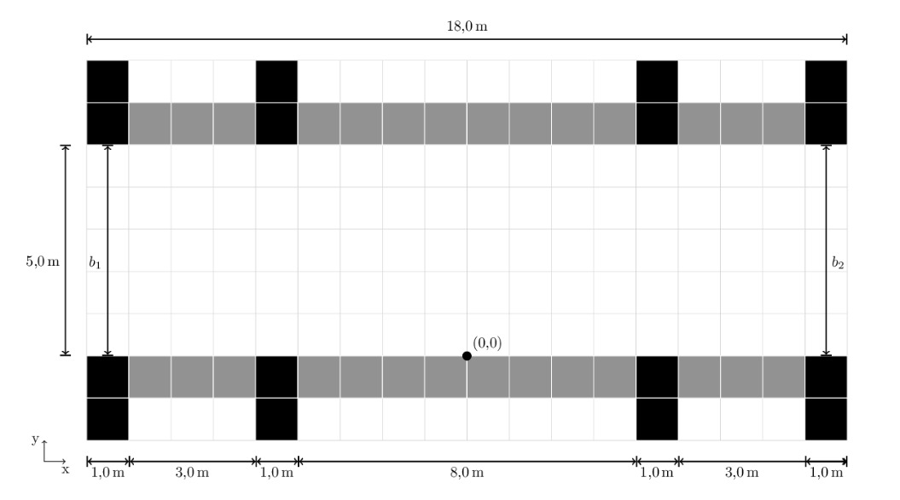
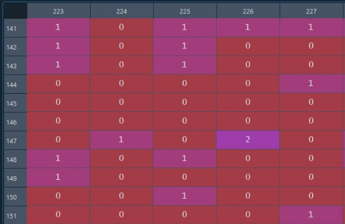
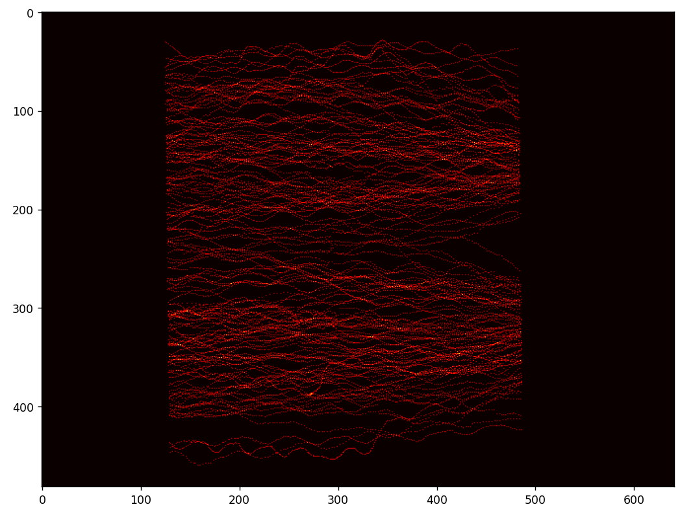

# Laboratorio 01: Cálculo de frecuencia peatonal 

## 1. Introducción 

El problema se enmarca en un interesante experimento que busca analizar cómo la densidad de personas y el ancho de las puertas afectan el tiempo de evacuación en un corredor con dos accesos, correspondientes a puerta 1 y puerta 2. 

La experimentacion plantea realizar nueve carreras, donde se variarán diferentes parámetros para obtener resultados significativos y generalizables. El corredor utilizado en el experimento ha sido diseñado cuidadosamente para asegurar la simetría entre ambos lados. Esto significa que las condiciones en los lados izquierdo y derecho del corredor son iguales, permitiendo la realización de carreras desde ambas puertas en una secuencia alterna. La simetría del corredor ofrece varias ventajas, entre ellas, reducir el tiempo de preparación entre carreras individuales y minimizar la interferencia de factores externos que puedan sesgar los resultados.
Cada carrera en el corredor experimental representa un escenario único de densidad de personas y ancho de las puertas. Se variarán las cantidades de individuos presentes en el corredor y se ajustarán los anchos de las puertas 1 y 2 para recrear diferentes situaciones de alta densidad. La densidad de personas se define como la cantidad de individuos por unidad de área del corredor y se manipula cuidadosamente en cada carrera para representar diversos escenarios realistas.
El tiempo de evacuación se medirá desde el momento en que se dé la señal de inicio hasta que el último peatón haya abandonado completamente el corredor. Durante la evacuación, se registrarán diversos parámetros para analizar el flujo de personas, como la velocidad de desplazamiento a través de las puertas y el espacio que ocupan en el corredor.
Además de analizar los tiempos de evacuación, el experimento también se enfoca en evaluar la eficiencia en el uso del espacio del corredor durante la evacuación. Esto implica observar si la densidad de personas influye en la formación de congestiones o atascos en algún punto del corredor. Estos datos serán fundamentales para comprender cómo el ancho de las puertas y la cantidad de personas en el corredor impactan en la fluidez de la evacuación y en la seguridad de los peatones.
Los resultados obtenidos de las nueve carreras serán analizados y comparados exhaustivamente para identificar tendencias y relaciones significativas entre los factores estudiados. El análisis de los datos permitirá obtener conclusiones valiosas sobre cómo la densidad de personas y el ancho de las puertas interactúan para influir en el tiempo de evacuación y en la eficiencia del proceso.
Este tipo de investigación es esencial para mejorar el diseño y la gestión de espacios públicos, especialmente en áreas con alta afluencia de personas, como estadios, centros comerciales o eventos masivos. Además, los resultados podrían tener implicaciones prácticas en la planificación de medidas de seguridad y evacuación en caso de emergencias o desastres naturales.
En resumen, el experimento busca estudiar cómo la densidad de personas y el ancho de las puertas influyen en el tiempo de evacuación en un corredor simétrico con dos puertas. Se realizarán nueve carreras con diferentes escenarios de densidad y anchos de puertas para obtener resultados significativos. Los datos recopilados serán analizados minuciosamente para obtener conclusiones relevantes para el diseño de espacios públicos y medidas de seguridad en situaciones de alta afluencia de personas. Cabe destacar que los datos presentes en esta experimentacion corresponderan solo una medida fija del tamaño de las puertas, es decir solo se analizara un escenario del tamaño de estas.

### 1.1 Justificación 
La programación científica desempeña un papel fundamental en el cálculo de la frecuencia peatonal, especialmente en el campo de la investigación urbana y la ingeniería de transporte. El estudio y análisis sistemático de la cantidad de personas que caminan por diferentes áreas urbanas proporciona información valiosa para la toma de decisiones basadas en evidencia y la planificación efectiva de la movilidad urbana.
Una de las principales ventajas de utilizar la programación científica en el cálculo de la frecuencia peatonal es la capacidad de procesar grandes cantidades de datos de manera rápida y eficiente. Con el crecimiento de las ciudades y el aumento de la población, la cantidad de información recolectada sobre el flujo peatonal ha aumentado significativamente. La programación científica permite manejar esta gran cantidad de datos y realizar análisis complejos para identificar patrones y tendencias en el movimiento de peatones.
Además, la programación científica facilita la implementación de modelos matemáticos y algoritmos de aprendizaje automático para predecir la frecuencia peatonal en diferentes escenarios. Mediante la simulación computacional, es posible proyectar el impacto de cambios urbanos propuestos, como la construcción de nuevos edificios o la implementación de nuevos sistemas de transporte, en la movilidad peatonal. Esto es especialmente relevante en la planificación de infraestructuras y en la adopción de medidas para mejorar la seguridad y accesibilidad peatonal en áreas urbanas congestionadas.
La integración de datos provenientes de diversas fuentes también es un aspecto clave que la programación científica facilita. Sensores de conteo de personas, sistemas de transporte público y datos demográficos pueden combinarse y analizarse en conjunto para obtener una visión integral de la movilidad peatonal en un área específica. Esta visión holística permite a los urbanistas y planificadores tomar decisiones informadas y basadas en datos para optimizar la infraestructura y los servicios urbanos, mejorando la calidad de vida de los ciudadanos.
La precisión y la velocidad de la programación científica también juegan un papel crucial en el cálculo de la frecuencia peatonal. Los modelos matemáticos y algoritmos implementados pueden ajustarse y optimizarse rápidamente, lo que permite a los investigadores realizar múltiples escenarios y evaluar diferentes estrategias de planificación con eficiencia. Esto contribuye a una toma de decisiones más ágil y efectiva en la mejora de la movilidad urbana.
En conclusión, la programación científica se presenta como una herramienta poderosa en el cálculo de la frecuencia peatonal. Su capacidad para procesar grandes volúmenes de datos, modelar escenarios futuros y facilitar la integración de diversas fuentes de información, hace posible tomar decisiones más informadas en la planificación urbana. La programación científica impulsa la creación de ciudades más amigables con los peatones, mejorando la calidad de vida de los ciudadanos y promoviendo una movilidad urbana más sostenible y eficiente.

### 1.3 Objetivos 

**Objetivo General**:
Realizar un análisis de patrones de concentración de personas en un entorno monitoreado a través del procesamiento y análisis de datos de coordenadas capturados por una cámara, utilizando programación científica en Python.

**Objetivos específicos**

1. Cargar y preprocesar el conjunto de datos "UNI_CORR_500_01.txt" en el entorno de Visual Studio Code utilizando el lenguaje de programación Python.
2. Almacenar las coordenadas X, Y y Z de las muestras capturadas en estructuras de datos apropiadas para su posterior análisis.
3. Identificar las coordenadas que se repiten con mayor frecuencia en las muestras capturadas, lo que permitirá determinar las áreas de mayor concentración de personas en el entorno monitoreado.

Estos objetivos permitirán llevar a cabo un análisis detallado de la frecuencia de aparición de coordenadas y la identificación de patrones de concentración de personas, contribuyendo así a una mejor comprensión de la distribución espacial de las personas en el área monitoreada.
## 2. Marco teórico (800 caracteres)

Librerias:

**Matplotlib**: Matplotlib que entrega una gran cantidad de funciones para la obtencion de graficos, y elementos ilustrativos, que permiten la visualizacion de los datos, para este experimento en especifico, se utilizara con el objetivo de poder crear un mapa de calor que permita identificar puntos criticos del paso peatonal.

**Numpy**: Corresponde a una libreria, que permite calculos multidimensionales en python, siendo fundamental, para la ciencia de datos y computacion cientifica.

**Time**: es una libreria util para entregar mediciones de tiempo en el sistema, su funciona radicara en entregar el tiempo en ejecutacion para cada codigo.

**Psutil**: Esta libreria permite el acceso a es una herramienta útil en Python que proporciona una interfaz para acceder a información sobre procesos en ejecución y recursos del sistema en el que se está ejecutando el código, en este caso sera usada para lograr obtener la cantidad de memoria requerida para el procesamiento del codigo.

Estructuras:

**Listas**: Las listas son colecciones ordenadas y mutables de elementos que pueden contener diferentes tipos de datos. Se definen utilizando corchetes "[]", y los elementos se separan por comas. Para la experimentacion, se hara uso de listas con el fin de poder extraer y almacenar las diversas coordenadas e informacion sobre los datos existentes en la base de datos entregada

**Diccionarios**: Los diccionarios son colecciones de pares clave-valor no ordenadas. Cada elemento del diccionario tiene una clave única asociada a un valor. Se definen utilizando llaves "{}". La importancia de esta estructura radica en la capacidad de poder asociar un dato obtenido con las frecuencias que se obtienen de este.

**Cadenas de Texto**: Las cadenas son secuencias de caracteres y se pueden tratar como estructuras de datos en Python. Se definen utilizando comillas simples o dobles. Por ejemplo: mi_cadena = "Hola, mundo!".

Herramientas:

**Anaconda**: Anconda representa una de las muchas aplicaciones que permiten la interacion con el lenguaje de programacion python, la cual entrega un entorno de visualizacion amigable para el usuario, ademas de una gran cantidad de librerias y funciones, por otro lado tambien permite la creacion de diversos ambiente para diferenciar entre proyectos.

**Visual Studio**: Visual Studio es un entorno de desarrollo integrado (IDE), el cual brinda una plataforma completa y versátil para construir, depurar y desplegar aplicaciones de software. Con soporte multiplataforma y para diversos lenguajes de programación entre los que se descataca Python, por otro lado tambien ofrece una interfaz gráfica de usuario intuitiva que facilita la creación de proyectos. Además, cuenta con herramientas de depuración y pruebas, por otro lado tambien integra interacciones con la nube como lo seria Github. Para esta experimentacion se hara el desarrollo de la aplicacion en lenguaje python, para luego ser exportada a gihub.

**Ipython**: IPython es un entorno interactivo de Python que proporciona una experiencia de shell mejorada en comparación con la consola de Python estándar. IPython se ejecuta en la línea de comandos y ofrece características adicionales, como autocompletado, historial de comandos, capacidades avanzadas de visualización de datos y soporte para la ejecución de comandos de sistema operativo. Esta se encuentra relacionada con Visual studio, debido a que  IPython se puede utilizar en conjunción con el entorno de desarrollo integrado de visual studio, obteniendo una experiencia mas completa.

**Github**:
GitHub es una plataforma de alojamiento y colaboración para el desarrollo de software, donde los desarrolladores pueden almacenar, gestionar y compartir su código fuente y archivos de proyectos. Esta es reconocida por facilitar la colaboración en proyectos y la comunidad de código abierto. Sus características clave incluyen control de versiones con Git, repositorios públicos o privados, herramientas para colaboración efectiva, seguimiento de problemas y errores, ramas para desarrollo independiente y la integración continua para automatizar pruebas y despliegues. GitHub se ha convertido en una herramienta esencial para el desarrollo colaborativo y el acceso a una amplia gama de proyectos y recursos de desarrollo.

## 3. Materiales y métodos

En este laboratorio se utilizarán diversos elementos para llevar a cabo el análisis de patrones de concentración de personas a partir de un conjunto de datos capturados por una cámara. A continuación, se detallará cada elemento y la metodología a seguir.
En el desarrollo de este laboratorio, se hará uso de diversos elementos esenciales para llevar a cabo un análisis detallado de patrones de concentración de personas. En primera instancia, se utilizará un archivo de texto denominado "UNI_CORR_500_01.txt", el cual contiene una colección de 25.535 muestras de coordenadas. Estas coordenadas han sido capturadas mediante una cámara en un entorno específico, permitiendo obtener información detallada sobre la ubicación de las personas en dicho espacio. Es importante resaltar que cada observación contenida en el dataset abarca no solo las coordenadas en los ejes X, Y y Z, sino que también incorpora datos fundamentales como el ID de la persona enfocada y el número de Frame de la cámara correspondiente. Esta combinación de información brinda una visión completa de las posiciones de las personas en relación con su identificación y el momento de captura. 
Por otro lado la representacion grafica de el espacio existente para el paso peatonal se evidencian en la siguiente ilustraciones, la cual presenta un largo de 18 metros, siendo el medio el punto (0,0).

ilustracion 1: Dimensiones paso peatonal

Para el procedimiento de este laboratorio se realizarán varias etapas cruciales. En primer lugar, emplearemos la plataforma Visual Studio Code junto con el lenguaje de programación Python para cargar el archivo "UNI_CORR_500_01.txt". Una vez completado el proceso de carga extraeremos las coordenadas X e Y del conjunto de datos y las almacenaremos en estructuras de listas de Python, lo que simplificará su manipulación y análisis subsiguiente. A continuación, procederemos al análisis de frecuencia para determinar qué conjuntos de coordenadas X, Y y (X, Y) se repiten con mayor frecuencia, lo que permitirá identificar patrones significativos de concentración de personas en el entorno observado. A continuación, se realizará la conversión de las coordenadas de metros a pixeles, lo cual nos brindará una representación más precisa de la distribución espacial. Posteriormente, emplearemos estos datos transformados en una matriz la cual será utilizada para generar un mapa de calor, visualizando claramente las zonas de mayor afluencia de personas. Este mapa de calor será una herramienta valiosa para comprender de manera intuitiva los patrones de movimiento y concentración en el entorno monitoreado, lo que proporcionará información clave para la toma de decisiones en la planificación urbana y la optimización de la movilidad peatonal. En resumen, este laboratorio fusiona el poder de la programación científica con la visualización de datos para obtener conocimientos profundos sobre la frecuencia peatonal y su distribución en un entorno específico.
En resumen, la secuencia de pasos sería la siguiente:
1. Cargar el archivo "UNI_CORR_500_01.txt" en el entorno de Visual Studio Code para su acceso y manipulación.
2. Extraer minuciosamente las coordenadas X e Y de cada observación registrada en el conjunto de datos, y almacenar estas coordenadas en listas o diccionarios apropiados.
3. Calcular rigurosamente la frecuencia de aparición de cada conjunto único de coordenadas (X, Y) en el conjunto de datos, lo que permitirá comprender qué patrones son más comunes en el entorno monitoreado.

4. Identificar con precisión las coordenadas que presentan mayor frecuencia de aparición, lo que nos brindará una visión clara de las áreas de mayor concentración de personas en el espacio observado.
5. Generar visualizaciones gráficas como mapas de calor, utilizando una matriz con las coordenadas transformadas en unidades de píxeles, para ilustrar de manera efectiva los patrones de concentración peatonal en el entorno. Estas representaciones visuales facilitarán la interpretación y comprensión intuitiva de los resultados obtenidos.
Al llevar a cabo esta secuencia de pasos, lograremos analizar y visualizar de manera precisa la frecuencia peatonal en el entorno estudiado, proporcionando valiosa información para la toma de decisiones en la planificación urbana y la mejora de la movilidad peatonal.
*3. Descripción del experimento:*
El experimento consiste en analizar las coordenadas capturadas por una cámara en un entorno específico para identificar patrones de concentración de personas. A través del uso de programación científica en Python y herramientas de análisis de datos, se pretende determinar las áreas en las que las personas se agrupan con mayor frecuencia. Este análisis proporcionará información valiosa para la toma de decisiones en la planificación urbana y la mejora de la movilidad en áreas de alta concentración peatonal. El experimento busca contribuir a la comprensión de los patrones de comportamiento de las personas en espacios urbanos, lo que puede tener implicaciones significativas en el diseño de infraestructuras y la implementación de medidas de seguridad y accesibilidad.

## 4. Resultados obtenidos

Para obtener una conclusion certera sobre la realizacion del experimento se realizaron 2 archivos .py donde ambos responden de igual manera a los objetivos planteados, pero se diferencian en la forma de creacion, desde el como se extraen los datos, hasta la creacion de la matriz de frecuencias.

En la tala a continuacion se puede observar como el primero archivo "Codigo 1.py", presenta una mayor eficiencia computacional, utilizando un menor tiempo de procesamiento, y un menor uso de memoria durante la ejecucion del codigo.

| Tipo de Experimento   | Tiempo de ejecucion (mseg) |  Memoria utilizada (MB) |
|-----------------------|----------------------------|-------------------------|
| Programa Uno (Codigo 1.py) |        255.5286            |           31.777        |
| Programa Dos (Codigo 2.py) |        303.28607           |           44.515        |

Tabla 1: Tiempos de ejecucion

Por otro lado en cuanto a los resultados obtenidos, se puede concluir que se logro responder a lo solicitado, logrando obtener las coordenadas X, y e (X,y) mas repetidas en la base de datos en medida de metros.
Con esta informacion se puede identificar los puntos que presenten un mayor flujo peatonal, siendo informacion relevante para el estudio del problema. Ademas se pudo concluir y observar que se presentaba un valor de z constante para cada una de las observaciones, lo cual nos indicaba que el piso se encontraba nivelado y esta coordenada no era significativa para el caso de estudio, por lo cual no fue considerada.

En cuanto a la varianza se observa alta para la coordenada X indicando un total de 8.219 lo cual nos representa una gran dispersion considerando que el recorrido de la cordenada x es de 18 metros, se concluye que es de esta forma debido a que las personas deberan transitar  a lo largo del eje x para poder llegar al destino, por lo cual la coordenada mas importante a analizar corresponderia a la "y", la cual presenta un valor en su varianza del 1.31 metros siendo un valor bajo y aceptable.

Coordenadas | Promedio |  Varianza |
|-----------------------|----------------------------|-------------------------|
| X |   -0.528            |           8.291        |
| Y |          2.552         |           1.316        |

Tabla 2: Promedio y varianza

En cuanto a la matriz de frecuencias, como se evidencia a continuacion, representa la cantidad de ocaciones donde una coordenada x e y fue intersectada por algun usuario donde la fila corresponde al eje x y la columna al eje Y, por ejemplo en el punto (147,226) se encontro que 2 personas transitaron por este misma ubicacion, esto permite obtener las zonas criticas, de el paso peatonal.

ilustracion 2: Matriz de frecuencias

Un mapa de calor es una representación gráfica que nos permite visualizar la distribución espacial de un fenómeno o variable en un área determinada. En este contexto, si consideramos el comportamiento de las personas al transitar por un pasillo, un mapa de calor revelaría cómo se distribuyen las frecuencias de tránsito a lo largo de dicho pasillo.

En el mapa de calor discutido previamente, se observa un patrón peculiar en la distribución de las personas. Las áreas extremas del pasillo, es decir, las zonas más cercanas a las paredes en el eje y, aparecen con una intensidad de color más baja en el mapa, indicando que hay una menor cantidad de personas que transitan por estas áreas. Del mismo modo, el centro del pasillo también presenta una intensidad de color más baja, lo que sugiere que las personas evitan congregarse en esta zona, conservando distancia ademas entre ellas.

En contraste, las áreas intermedias del pasillo muestran una intensidad de color más alta en el mapa de calor, lo que indica una mayor concentración de tránsito peatonal. Esto respalda la idea de que las personas tienden a mantenerse a una distancia equidistante de las paredes del eje y, ademas del centro, posiblemente para maximizar su espacio personal y comodidad al caminar. Este patrón podría interpretarse como una estrategia consciente de las personas para evitar el hacinamiento en el centro y para mantener un cierto margen de separación de las paredes y entre ellos.

Por otro lado, también se puede observar cómo los datos se muestrean únicamente hasta ciertas coordenadas en el eje x, lo que indica que la cámara no captura una vista completa del pasillo. Además, en el mapa de calor se puede apreciar cómo las personas se desplazan a lo largo del tiempo.

ilustracion 3: Mapa de calor

## 5. Conclusiones

Basándonos en los resultados obtenidos, es posible extraer valiosas inferencias que contribuyen al conocimiento. Por ejemplo, al emplear un bucle 'for' para buscar el valor máximo justo antes de un comando 'print', se identifica una desaceleración en la ejecución del código. En contraste, la realización de la búsqueda del valor máximo con antelación al comando 'print' demuestra ser más óptima en términos de tiempo de ejecución.
Estos descubrimientos enfatizan la relevancia de la optimización en la programación y cómo decisiones aparentemente pequeñas en la estructura del código pueden tener un impacto significativo en el rendimiento general. La experimentación y análisis minucioso de diferentes enfoques son esenciales para identificar las mejores prácticas que garanticen una ejecución eficiente y un uso optimizado de recursos computacionales. En última instancia, la inferencia de nuevo conocimiento a partir de los resultados refuerza la importancia de la constante revisión y mejora de los procesos de programación.

Por otro lado tambien se logra identificar que la creacion de variables adicionales y ciclos for adicionales, generan que se demore mucho mas el sistema en procesar el codigo, esto se observa en el codigo 2 debido a que la lectura del archivo corresponde a variables auxiliares, que no son tan necesarias para luego ser leidas en un ciclo for apartado del inicial, cosa que no pasa en el codigo 1 ya que todo es obtenido en el primer ciclo for.

Finalmente podemos concluir que se lograros los objetivos especificos y generales, debido a que se pude extraer la informacion del archivo entregado, logrando representar los puntos criticos mas utilizados por los peatones, pudiendo representar esto en la matriz de frecuencias para lograr obtener un mapa de calor, que nos muestre visualmente como se distribuyen estos puntos criticos, a lo largo del pasillo.

